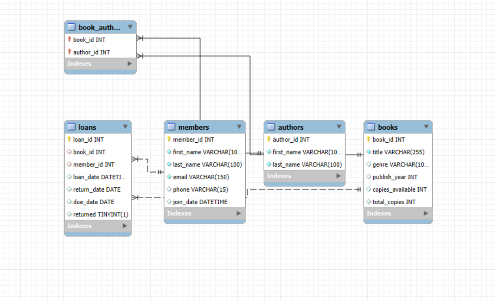

# Library Management System

## Project Description
The **Library Management System** is a relational database-based application built using MySQL to manage the operations of a library. It helps to organize and track books, members, loans, and authors efficiently.

This project implements key functionalities such as:
- **Managing books:** Add, update, and delete book records.
- **Tracking loans:** Manage books borrowed by library members, including loan dates and due dates.
- **Managing authors and book-author relationships.**
- **Tracking members:** Manage library member details, including their contact information and loan history.

The system is designed for a mid-sized **Engineering Library** and follows a relational database schema to maintain relationships between books, authors, and loans.

## Features
- **Books:** 
  - Add, remove, and modify book information.
  - Track availability and copies of each book.
- **Members:**
  - Maintain member details like name, email, phone number, and join date.
  - Track the borrowing history of members.
- **Loans:**
  - Track loans and returns of books, with due dates and overdue checks.
- **Authors:**
  - Maintain author details and manage book-author relationships.
- **Reporting:**
  - Query-based reports for frequently borrowed books, popular authors, and active members.

## Database Structure
The system consists of the following key tables:
1. **Books**
2. **Members**
3. **Authors**
4. **Loans**
5. **Book_Authors**

Each table has been normalized and structured to avoid redundancy, ensuring data integrity.

## ER Diagram
Below is the entity-relationship (ER) diagram illustrating the relationships between different tables in the database:



## Technologies Used
- **MySQL**: Relational Database Management System for storing and managing data.
- **Git**: Version control for managing the project codebase.
- **GitHub**: Repository hosting service for collaboration and version control.

## How to Use
1. Clone this repository to your local machine:
   ```bash
   git clone https://github.com/Shreepad6969/Library-Management-System.git
